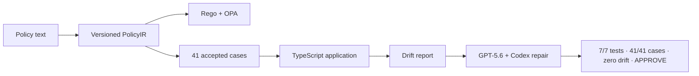

# PolicyTwin

**Turn a policy sentence into rules, tests, application behavior, and reviewable proof.**

Refund policies are written in prose, but products enforce them in code. A single `<` instead of `<=`, or one exception in the wrong order, can change who receives a refund. PolicyTwin keeps the policy and the implementation in sync.


## Build Week result

PolicyTwin found three seeded bugs in a TypeScript refund application, asked GPT-5.6 Sol through Codex to repair a disposable copy, and then checked the result independently.

| Result | Evidence |
|---|---:|
| Seeded application bugs | 3 |
| Counterexamples before repair | 16 |
| Codex-authored files changed | 2 |
| Regression tests after repair | 7 / 7 |
| Accepted policy cases after repair | 41 / 41 |
| Application drift after repair | 0 |
| Independent review | `APPROVE` |

- [Watch the 2:48 demo](https://youtu.be/h7o1vXmWC-M)
- [View the submitted Devpost entry](https://devpost.com/software/policytwin)
- [Inspect the captured GPT-5.6/Codex evidence](artifacts/challenge-evidence/summary.md)
- Primary Codex `/feedback` session: `019f5dcf-0233-7a80-9147-af10c7bbfb28`

## How it works

1. **Policy Studio** links each source clause to a strict, versioned `PolicyIR`.
2. **Decision Queue** makes boundary and precedence choices explicit instead of hiding them in a prompt.
3. A deterministic compiler converts accepted `PolicyIR` into Rego, and checksum-pinned OPA evaluates it.
4. **Case Lab** generates boundary, conflict, contrast, and mutation cases.
5. **Integration / Drift** runs the same expectations against the TypeScript application and shows concrete counterexamples.
6. Codex repairs only the two approved fixture files; PolicyTwin derives the diff, runs fixed commands, replays all 41 cases, and requires an independent review.



## Try the judge path

Requirements: Node.js 22+, pnpm 11.7+, and Windows PowerShell. The deterministic demo does not need an API key.

```powershell
pnpm install --frozen-lockfile
pnpm opa:install
pnpm demo:run
pnpm dev
```

Open `http://localhost:3000`, then review these views in order:

1. Policy Studio
2. Decision Queue
3. Case Lab
4. Integration / Drift
5. Proof
6. Change Impact

`pnpm demo:run` resets only the bundled trusted fixture and must report exactly the three seeded drifts. The strongest result is visible in **Integration / Drift**: two changed files, 7/7 regressions, 41/41 accepted cases, zero drift, and `APPROVE`.

## What is demonstrated—and what is next

| Area | Current Build Week evidence |
|---|---|
| Policy contract, decisions, Rego, OPA, cases, and drift | Working deterministic product flow |
| GPT-5.6/Codex repair | Captured real bounded run with filesystem-derived diff and independent review |
| Natural-language interpretation | The judge demo starts from a recorded, schema-validated `PolicyIR`; a fresh direct Responses API interpretation was not run |
| Browser-triggered repair | The UI presents the verified captured repair; a fresh hosted repair worker is not connected to the button |
| Production deployment and isolation | Separate future hardening track, not a Build Week result claim |

These boundaries are intentional and visible. PolicyTwin never turns missing production infrastructure into a success claim.

## Reproduce the captured result

The checked-in capture can be validated without making a new model call:

```powershell
pnpm challenge:check
pnpm challenge:submission:check
```

Key evidence:

- [`artifacts/challenge-evidence/summary.md`](artifacts/challenge-evidence/summary.md) — human-readable repair result
- [`artifacts/challenge-evidence/local-challenge-run.json`](artifacts/challenge-evidence/local-challenge-run.json) — model, commands, cases, review, and hashes
- [`artifacts/challenge-evidence/integration.diff`](artifacts/challenge-evidence/integration.diff) — filesystem-derived repair diff
- [`artifacts/evidence/summary.md`](artifacts/evidence/summary.md) — deterministic reference evidence
- [`artifacts/challenge-submission/`](artifacts/challenge-submission/) — final challenge handoff

## Useful commands

| Command | Purpose |
|---|---|
| `pnpm demo:reset` | Restore the trusted demo fixture and local demo state |
| `pnpm demo:run` | Reproduce the three seeded drifts |
| `pnpm dev` | Start the six-view web workspace |
| `pnpm challenge:check` | Validate the captured GPT-5.6/Codex repair evidence |
| `pnpm challenge:submission:check` | Validate challenge links, video binding, and handoff metadata |
| `pnpm verify` | Run the deterministic offline repository gate |
| `pnpm verify:live` | Separate production-live gate; not required to inspect the captured challenge result |

The last recorded offline gate passed 452 unit tests, 82 integration tests, 22 evaluation tests, 3 browser tests, production build, clean-copy replay, and security/history checks. See [`PROGRESS.md`](PROGRESS.md) for the exact checkpoint.

## Optional server configuration

Copy `.env.example` only when working on server-side integrations. Never expose these values to the browser or commit them.

| Variable | Purpose |
|---|---|
| `OPENAI_API_KEY` | Server-side Responses API credential |
| `OPENAI_MODEL` | Configurable interpretation model; defaults to `gpt-5.6` |
| `CODEX_MODEL` | Explicit Codex repair model |
| `POLICYTWIN_RUN_TOKEN` | Protects the interpretation route |
| `POLICYTWIN_DATABASE_PATH` | Optional SQLite location |

The bounded Build Week capture used `gpt-5.6-sol` through the project-pinned Codex SDK/CLI 0.144.6 against a disposable fixture. Codex produced complete replacements for `src/refund.ts` and `tests/refund.test.mjs`; PolicyTwin—not model prose—derived and verified the result.

## Architecture, safety, and limitations

PolicyTwin executes only the bundled trusted refund fixture. It does not execute uploaded or arbitrary repositories. It is a software verification aid, not legal advice; real policy deployment requires human approval.

Detailed engineering material is kept out of the quick judge path:

- [Architecture](docs/architecture.md)
- [Demo runbook](docs/demo-runbook.md)
- [Threat model](docs/threat-model.md)
- [Limitations](docs/limitations.md)
- [Decision record](DECISIONS.md)
- [Submission record](SUBMISSION.md)

## License

MIT License. Copyright (c) 2026 CHAN. See [`LICENSE`](LICENSE) and [`NOTICE.md`](NOTICE.md).
