# PolicyTwin

**Turn policy text into verified product behavior.**

Refund policies live in prose while product decisions live in code; one strict inequality or misplaced exception can silently change customer outcomes.

PolicyTwin is an evidence-first policy engineering product for OpenAI Build Week. It turns a natural-language SaaS refund policy into a versioned executable contract, exposes ambiguity and application drift, and produces reviewable proof.


## One-command seeded demo

After the dependencies in [Local setup](#local-setup) are installed, reproduce the three deliberate refund defects with one deterministic command:

```powershell
pnpm demo:run
```

The command resets only the bundled trusted fixture, compiles it, and must report exactly three case-by-case drifts. It does not make an OpenAI request or claim a Codex repair.

## Current status

The repository now includes:

- strict `PolicyIR`, clause traceability, immutable ambiguity decisions, and SQLite-backed versions;
- a deterministic PolicyIR-to-Rego compiler and checksum-pinned OPA 1.18.2 execution over 41 accepted cases;
- boundary, conflict, contrast, differential, and mutation checks that expose all three seeded TypeScript defects;
- a server-only GPT-5.6 Responses adapter contract whose model-output schema, runtime structural admission, and checked-in JSON Schema derive from one strict Zod definition, with one-attempt refusal/incomplete/failed-outcome handling, full-source traceability, golden-case contradiction blocking, bounded retries only for recoverable output defects, and a token-gated HTTP route;
- a server-only Codex SDK 0.144.3 adapter contract plus a real Node TLS 1.3 mutual-authentication transport and bounded supervisor service, with CA/name/certificate-pin/ALPN checks, canonical length frames, durable SQLite replay rejection, trusted supervisor signatures, host-known baseline/final tree-manifest comparison, a fixed two-file write set, and host live execution still disabled;
- an internal, non-barrel-exported Worker RPC v2 execution core that binds request, input, policy, execution, report, and active-time-window hashes to the existing cartography/repair/verification/review orchestrator. It accepts only the non-live mode but truthfully labels its injected backend `UNVERIFIED_INJECTED_BACKEND`, rejects sensitive content across the final report, returns a deeply frozen `UNSIGNED_WORKER_EXECUTION_CANDIDATE` with every live/signing/settlement flag false, and is not connected to the worker entrypoint, Docker role plan, signed response, or repair-run success path;
- an internal verifier-corpus pre-authority contract that serially evaluates the exact 41 accepted cases through a structurally untrusted injected application evaluator. It rechecks one active canonical RPC v2 request and caller-owned binding before and after every case, requires both typecheck and test to preserve the same caller-observed tree, binds canonical request/policy/corpus/result hashes, and labels evaluator, attempt/run, command, tree, and injected-clock observations as unverified. Its deeply frozen `UNSIGNED_VERIFIER_CORPUS_CANDIDATE` is absent from the root export. TypeScript AST inspection with module resolution rejects supported production module edges from `src/`, `scripts/`, or `app/`, all non-literal direct import/require calls, and common indirect `require`/`createRequire` constructions; the contract explicitly labels this static graph evidence as not runtime proof. It cannot parse as `PolicyVerificationEvidence` or a v2 response, cannot be consumed as a validated external run, and has live/signing/settlement eligibility false;
- a separate non-root-exported verifier exchange and review bridge that locally reinspects exact source/build trees, binds the active RPC v2 request and accepted 41-case corpus into a one-use HMAC receipt, and persists issue/consume/poison state plus request-attempt tombstones and a clock high-water mark in a sealed SQLite schema. PASS permits one receipt-bound structural review; FAIL attempt 1 permits one fresh-snapshot retry. This remains `BOUND_NOT_RUNTIME_FINALIZED`: capability delivery is an in-process test seam, tree inspection is not runtime immutability proof, review is a caller-supplied bound echo rather than live reviewer proof, and no worker response, signer, settlement, web executor, or live gate consumes it;
- a session-bound SQLite repair-run/event ledger, idempotent same-origin run creation, resumable Server-Sent Events, restart-safe fail-stop states, and an Integration timeline that records the current unavailable executor as `BLOCKED / NOT_STARTED` without making a model-call claim. The future authenticated seam maps each local `rr_<32 hex>` identity injectively onto the already signed v2 `requestId`, accepts only a factory-issued one-use settlement, and keeps any transport or cleanup-uncertain outcome `POISONED`;
- static supervisor-owned worker/verifier/egress plans, a shell-free ID-owned Docker driver verified against a stateful fake daemon, and an OpenAI Responses-only reverse broker that gives the worker only a short-lived capability, keeps the provider credential in an external proxy mount, and remains explicitly non-live until the real Docker and SDK paths run;
- Policy Studio, an anonymous-session-isolated SQLite Decision Queue, Case Lab, Integration/Drift, Proof, and blocked Change Impact views in Next.js;
- Chrome E2E coverage for all six views, browser-session isolation, versioned decision/source writes, CSRF rejection, golden-conflict blocking, complete evidence downloads, keyboard navigation, and a 390px mobile layout;
- a complete, hash-covered `PARTIAL_OFFLINE` evidence package, adversarial semantic validation, a byte-deterministic 38-file USTAR download, and fail-closed submission drafts.

The repository is **not submission-ready**. Fresh GPT-5.6 and Codex runs, actual Codex repair evidence, dynamic container/egress proof, deployment, video, repository/submission URLs, an owner-selected project license, and confirmation are still missing. The evidence package therefore remains `FAIL / PARTIAL_OFFLINE` by design.

## Architecture

```mermaid
flowchart LR
  A["Refund policy + golden cases"] -.-> B["GPT-5.6 interpretation (live disabled)"]
  B --> C["Validated PolicyIR"]
  C --> D["Versioned ambiguity decisions"]
  D --> E["Deterministic Rego compiler"]
  E --> F["OPA + generated cases"]
  F --> G["TypeScript differential runner"]
  G --> H["Session-bound repair-run ledger + SSE"]
  H -.-> I["Signed external-worker v2 RPC (live disabled)"]
  I -.-> J["Hash-covered live proof"]
  J -.-> K["Trusted live attestation"]
```



Dashed edges are planned live execution and have not run. Model output never becomes the final executable policy. The validated IR is compiled deterministically, every rule traces to source clauses, and golden-case contradictions fail closed.


## Local setup

Requirements:

- Node.js 22 or newer;
- pnpm 11.7 or newer;
- Chrome for E2E tests;
- OPA 1.18.2 at `.tools/opa/1.18.2/opa.exe` on Windows, or an explicit `OPA_PATH`.
- OpenSSL 1.1.1 or newer for ephemeral mTLS integration-test certificates; Git for Windows is auto-detected, or set `OPENSSL_PATH`.

```powershell
pnpm install --frozen-lockfile
pnpm opa:install
pnpm evidence:offline
pnpm dev
```

Open `http://localhost:3000`. Package installation and `pnpm opa:install` require network access on a new machine; the OPA installer downloads and verifies the official pinned binary. If the exact pnpm store is already populated, `pnpm install --offline --frozen-lockfile` is the deterministic offline alternative. If OPA is already installed, set `OPA_PATH` instead.

Copy `.env.example` to a local ignored environment file when exercising live integrations or overriding the local SQLite path:

| Variable | Purpose |
|---|---|
| `OPENAI_API_KEY` | Server-side Responses API access; a future live supervisor must mount the provider credential only into the egress broker, never the browser or worker |
| `OPENAI_MODEL` | Configurable model, default `gpt-5.6` |
| `CODEX_MODEL` | Required explicit model for live repair; no personal Codex default is inherited |
| `POLICYTWIN_RUN_TOKEN` | High-entropy token required by `POST /api/interpret` |
| `POLICYTWIN_ATTESTATION_PUBLIC_KEYS_JSON` | Ed25519 public-key map used to verify live evidence; every key ID/SPKI hash must also be pinned in `config/attestation-trust.v1.json`; never a private key |
| `NEXT_PUBLIC_SITE_URL` | Absolute site URL used for metadata |
| `POLICYTWIN_PUBLIC_ORIGIN` | Exact browser-facing origin for workspace mutation checks; HTTPS is mandatory in production |
| `OPA_PATH` | Optional verified OPA executable override |
| `OPENSSL_PATH` | Optional OpenSSL executable override used only to generate temporary mTLS test certificates |
| `POLICYTWIN_DOCKER_CLI` | Canonical absolute Docker CLI path required by every dynamic container gate; its binary SHA-256 must match the separately reviewed value in `container-contract.json`, and the gates force the platform-local daemon without searching `PATH` |
| `POLICYTWIN_DATABASE_PATH` | Optional absolute SQLite file path; defaults to ignored `.data/policytwin.sqlite` |
| `POLICYTWIN_REPAIR_RUN_DATABASE_PATH` | Optional distinct absolute SQLite file for repair runs/events; defaults beside `POLICYTWIN_DATABASE_PATH` and is reset with the local demo |
| `POLICYTWIN_CODEX_*_TIMEOUT_MS` | Reserved values for the future external worker; the current host does not consume them |

Without `POLICYTWIN_RUN_TOKEN`, the live interpretation route returns `LIVE_RUN_DISABLED`. The Integration action may create a durable blocked audit record, but its execution port remains unavailable. A run can become successful only from a fresh, one-use object issued by the authenticated Worker RPC v2 client after signature, request/input, CPU, teardown, exact two-file, two-command, complete-corpus, and review checks. Raw objects, unsigned candidates, JSON copies, and test-double summaries fail. The host process still cannot construct a live Codex backend, and no live model or Codex claim is made from recorded fixtures or fake-SDK tests.

## Verification

```powershell
pnpm lint
pnpm typecheck
pnpm test
pnpm test:integration
pnpm test:e2e
pnpm exec playwright test --config=playwright.screenshots.config.ts
pnpm eval
pnpm build
pnpm schema:check
pnpm demo:reset
pnpm demo:run
pnpm evidence:offline
pnpm security:check
pnpm clean:check
pnpm verify
pnpm verify:live
pnpm container:check
pnpm container:verify
pnpm worker:verify
pnpm egress:verify
pnpm submission:check
```

Normal `pnpm test:e2e` and `pnpm verify` capture all seven browser views under ignored `.tmp/playwright-screenshots/`, so verification never rewrites Git-managed release assets. Run `pnpm exec playwright test --config=playwright.screenshots.config.ts` only when intentionally refreshing `artifacts/screenshots/`; inspect every resulting image before committing it.

The account-dependent final checker first runs `pnpm verify` itself in the same non-recursive release-check process. It then fixes exact submission, demo, screenshot, and 38-file evidence sets; state-specific owner action or content-bound confirmation evidence; complete SRT cues synchronized to the local video with bounded start, gap, cue count, and timeline coverage; a 48-hour, exact-three-source official-rules window; evidence-backed metrics across every final text including README; distinct decoded non-uniform PNG captures at reviewable dimensions; and a non-fragmented two-to-three-minute audio/video MP4 that installed Chrome can demux, decode, expose as an audio-bearing stream, sample at three timeline points, visually distinguish, and seek at the tail. It independently re-runs semantic evidence and trusted Ed25519-attestation validation; an environment key is admitted only when its key ID and SPKI SHA-256 match the reviewed fixed release policy in `config/attestation-trust.v1.json`. The submitted live URL must equal the validated deployment/browser evidence URL and return an anonymous HTTPS 2xx response at the declared origin. The live probe rejects credentials, non-default ports, fragments, redirects, and any literal or resolved non-public address; it pins one already-validated address while preserving the declared hostname for TLS and `Host`. The GitHub or GitLab repository must expose anonymous `HEAD` through `git ls-remote` from a fresh non-repository directory with system/global configuration, credential helpers, and prompts disabled. These two probes are external network actions, run only when final URLs are present, and are skipped when the same invocation's offline gate fails. The checker also requires a fresh owner-reviewed YouTube publication receipt and binds the exact ordered offline verification results plus evidence/clean/security hashes to Git-managed release-input bytes, index object IDs, tracked state, index mode, and working mode with zero untracked files and exact raw-byte index/worktree equality. Unsafe assume-unchanged, skip-worktree, fsmonitor-clean, symlink, and external clean-filter shortcuts are rejected. That fingerprint is explicitly scoped to exclude the mutable `PROGRESS.md` ledger and its two self-reports; all three excluded paths must themselves remain tracked, and their hashes or semantics are checked separately where applicable. Every recognized numeric claim is compared with current evidence even when phrased as a future target. It does not discover or execute a system `ffmpeg` or `ffprobe`.

`pnpm demo:reset` removes only the default ignored policy and repair-run SQLite files and restores the trusted fixture; stop the development server first on Windows. It fails closed when either database variable points elsewhere and never deletes a custom file. Browser sessions receive separate seeded projects and run histories; new sessions require same-origin fetch metadata, expire after 24 hours, and are capped at 128 per process. Each session retains at most 16 attempts, while the shared external-executor seam admits only one queued, active, cleanup-pending, or poisoned run across all sessions. Session expiry deletes safe terminal run/event history, but deliberately retains active or poisoned rows as a global fail-stop latch until reset/operator recovery. This is bounded demo isolation, not user authentication or a multi-instance storage design. `pnpm demo:run` must report exactly three seeded drifts. `pnpm verify` is the deterministic offline gate: it runs the daemon-free static web/worker/verifier/egress contract plus the isolated fail-closed submission-draft check, but not the account-dependent final `submission:check`. `pnpm container:verify` is the separate dynamic web image/OPA/non-root/read-only-root/health gate. It requires the canonical `POLICYTWIN_DOCKER_CLI` and a byte-for-byte match with the reviewed Docker CLI SHA-256 in `container-contract.json`; the hash is checked again before each invocation. The gate then forces the platform-local daemon, requires the immutable base to exist locally, and builds with `--pull=false`. A nonce binds the temporary image, volume, and four container roles to exact labels; only independently inspected identities may execute or be removed. Every role is created with `restart=no`, zero restarts, equal 1 GiB memory/swap, PID 64, one CPU, a 16 MiB file ceiling, and one 16 MiB local log, and those values are observed before start. `pnpm worker:verify` owns a fresh labeled internal network and worker/verifier containers only after returned Docker IDs pass identity inspection; its Linux dynamic path also requires an exact Docker cgroup-v2 identity, private directory-FD/device/inode binding, a quiescent descendant tree, initial-PID absence, and original-cgroup release. `pnpm egress:verify` separately owns internal/outbound networks, the proxy, and a non-root TLS 1.3 probe. The probe closes after certificate verification without writing HTTP; the gate does not measure proxy outbound traffic and therefore does not claim upstream absence. The local Docker 29.1.5 daemon is running with `cgroupfs` and cgroup v1. The reviewed release-host Docker CLI hash plus immutable builder/base/helper identities are unset, so dynamic gates stop before Docker workload execution; after those identities are supplied, worker and egress verification still require a Linux cgroup-v2 supervisor and reject an ineligible host before the expensive build. `--pull=false` prevents a base-image pull but a cold Dockerfile build still needs the lock-pinned pnpm 11.7.0 packages and official OPA 1.18.2 download unless cached; it is not an offline-build claim. The web health gate and helper artifact gate have separate prerequisites and do not establish worker cgroup-v2 isolation. A required CPU-controller port and fake-only BigInt ledger now aggregate post-baseline egress, worker, and verifier use under one request budget and hold both raw receipts until that static proof is complete. The proof explicitly says cumulative enforcement, a hard limit, bounded overshoot, and containment are false. It cannot satisfy `pnpm verify:live`, which also rejects an unbound report boolean; a real Linux cgroup controller, fresh GPT-5.6/Codex repair, and signed evidence are still absent.

Browser evidence is under `artifacts/screenshots/`. Machine-readable proof is under `artifacts/evidence/`; every unavailable live result uses an explicit `NOT_RUN*` status rather than being simulated. The evidence API exposes every required artifact individually, and the Proof view builds `/api/evidence/archive` in memory from the exact 38-file allowlist, so transient files are never collected.

The Docker 29.1.5 `cgroupfs`/cgroup-v1 description above comes from a manual local `docker info` diagnostic. It is environment context, not a machine-generated isolation artifact and never substitutes for the required supervisor preflight or Docker-ID-bound observations.

The downloadable USTAR package proves the seeded reference choices (`purchase day 0`, request-time usage, and default denial). It is byte-stable for the same package, uses the archive SHA-256 as its ETag, keeps the semantic evidence hash in a separate response header, and fails closed on missing, extra, tampered, credential-shaped, or personal-path content. Proof compares the browser session's validated PolicyIR meaning with that reference before showing a match, and Change Impact refuses to create v5 when the choices differ.

Every archive request still rereads the bounded 38-file input and hashes every content byte plus the active trust and freshness policy. After that check, the server may reuse one defensively copied, already validated archive for at most 15 seconds; matching concurrent requests share one build, changed content or policy forces a rebuild, live-attestation expiry shortens reuse, and failures are never cached. Responses remain `Cache-Control: no-store`. This is a process-local work bound, not shared rate limiting or a multi-replica quota.

The SHA-256 manifest detects payload changes but is not an authenticity credential by itself. A future `LIVE_VERIFIED` package must also carry a fresh Ed25519 attestation over its evidence hash, run ID, and timestamp from a trusted `verify:live` key held outside the repository; the default verification window is 24 hours. Supplying an arbitrary public key at invocation time does not establish trust: its SPKI SHA-256 must match the reviewed key ID in `config/attestation-trust.v1.json`, which is deliberately unprovisioned in this checkpoint. The validator independently recomputes the compiler output, exact server-owned 41-case digest, accepted-case OPA agreement, differential records, mutation score, traceability, Codex command evidence, and structured GPT/browser/container/deployment/security proofs. It also recomputes every evaluation-scorecard value, target, and status—including the exact three seeded ambiguities, zero explicit-semantics mislabels, golden and boundary agreement, and rule-to-case coverage—so a self-rehashed scorecard cannot manufacture a claim. For the exact trusted seeded policy ID, request version, source hash, clause segmentation, and ambiguity source links only, interpretation replaces model wording/examples with the server-owned canonical ambiguity copy before admission; other policies and changed sources are never rewritten. Its canonical `integration.diff` must byte-for-byte match the content changes reconstructed from the attested before/after fixture receipts.

`pnpm clean:check` validates a source-only copy against the current machine's existing pnpm store, verified OPA path, and Chrome installation. It is not a claim that a network-disconnected fresh machine already has those prerequisites. On Windows, the Playwright server uses a UUID-scoped `.tmp` shutdown signal and acknowledgement; teardown waits for the acknowledgement and stable health failure before removing only those managed files.

`pnpm schema:check` rebuilds the core and verifies that `schemas/policy-ir.v1.schema.json` is byte-for-byte generated from `PolicyIRStructureSchema`. The Responses request uses the official Zod Structured Outputs helper over the model-owned projection, which excludes server-owned `metadata` and `inputSchema` and requires nullable ambiguity selections. The same projection is validated again before trusted fields are injected. Cross-reference integrity, predicate field/value compatibility, exact refund input schema, patch targets, source coverage, and golden-case agreement remain deterministic application checks; a schema-valid model response is not proof of policy correctness.

## Safety boundary

Only the bundled trusted refund fixture may be executed or modified. Uploaded or arbitrary repositories are never executed by the hosted flow. Secrets, absolute personal paths, and live credentials are excluded from evidence and screenshots.

Codex phases use distinct SDK threads. Cartography and review are read-only and fail if the fixture changes; repair uses workspace-write with network and web search disabled. Before any SDK turn, the adapter rejects sensitive or personal-path content in the complete trusted context and every canonical NUL-free UTF-8 fixture file. It rejects every SDK `command_execution` lifecycle event, so only the orchestrator may run the two fixed verification commands, and it rejects sensitive command output at the contract boundary. Model output cannot expand writes beyond `src/refund.ts` and `tests/refund.test.mjs`, nor set SDK provenance, changed files, command receipts, regression claims, or policy-verification results. Server-owned metadata binds the prompt template, complete request, and output schema hashes. The repair must enable the exact digest-pinned D01-D03 assertions already present as skipped tests, while the server requires the exact hash-bound golden-plus-generated 41-case corpus. It derives changes from fixture snapshots, retains successful results and runner/evidence failures for every attempt, and rejects any test that changes file content, structure, mode, or mtime after typecheck. A failed write phase poisons the disposable workspace so no later phase can reuse it. The server then evaluates all 41 cases through a separate trusted runner whose receipt is bound to the attempt, repair run, final execution tree, accepted corpus, and PolicyIR. The executed exact tests plus the 41-case receipt—not model prose or a reported link—are the regression proof. Missing, altered, erroring, or non-passing results block review.

The SDK sandbox is not treated as a host read jail. No web-process route invokes the live adapter, the host live-backend factory always rejects, and the local command runner rejects `LIVE_CODEX_SDK` outright. The repository now has a concrete Node TLS 1.3 client and supervisor service: both peers must chain to the configured CA, match pinned SHA-256 certificate fingerprints, negotiate the fixed ALPN, and the server certificate must match the fixed name. The wire protocol accepts exactly one bounded magic-plus-length canonical JSON request and response per connection. The supervisor rejects malformed, partial, oversized, trailing, replayed, expired, and concurrent requests before execution; a durable SQLite replay store rejects reuse of either request ID or nonce across restarts. Cancellation and supervisor shutdown abort the injected executor and wait for it to settle, while pre-handshake sockets are tracked and destroyed. Credential scanning covers parsed semantic request and response fields, while opaque nonces, hashes, and signatures use format, binding, and cryptographic validation so random capability bytes cannot cause token-pattern false positives. Complete envelopes still require canonical UTF-8, NUL-free bounded frames, closed parsing, and host-path rejection. The host then applies the existing 4 MiB/64 KiB/1,024-chunk, Ed25519, policy/image/corpus, tree-manifest, command, and teardown checks.

This proves local contracts only. The integration executor returns an explicitly labeled signed `FAIL` test result and performs no SDK work. Separate non-root worker, verifier, and egress Dockerfiles exist with immutable build-input hashes. A prepared entrypoint validates a canonical request and empty `CODEX_HOME` but can emit only `VALIDATED_REQUEST_LIVE_DISABLED`. Docker v3 derives every resource name and exact PolicyTwin labels from the request plus an independent nonce; existing names are never adopted, and a returned 64-hex ID grants cleanup authority only after independent ID/name/label inspection. The runner pins a canonical Docker executable and the platform-local daemon; the observer closes entrypoint, working directory, environment, namespaces, devices, security controls, bind propagation, tmpfs, ports, exact network membership, and an explicit `restart=no` policy. Stateful fake-daemon tests cover normal execution, name preemption, ambiguous/foreign IDs, partial creation, foreign endpoints, observer drift, published ports, swap/file/log limit drift, and sealed-image/maximum-limit admission. The supervisor pins each running container's ID/PID/start timestamp with zero restarts and reobserves the exact egress instance before and after worker execution and before proxy stop, so a stopped or replaced proxy invalidates the worker result. Init-PID-only procfs evidence is rejected. The schema-v10 non-live cgroup observer now accepts only exact Docker membership components, keeps follow-up reads on a private `O_DIRECTORY | O_NOFOLLOW` descriptor plus device/inode identity, parses the full `usage_usec` uint64 range as `bigint`, requires `cgroup.events populated 0` before the final sample, and reports subtree quiescence, initial-PID absence, original-cgroup release, and cleanup-action results separately. Caller-forged or finalized observation objects are rejected. These are offline contract checks only: the baseline is still taken after Docker start, no Linux Docker workload ran, and the observer is neither the D-040 private live adapter nor signer authorization. The supervisor seals the worker image and maximum request limits. Runtime memory and swap are equal, regular-file writes inherit the request output ceiling, and the local Docker log uses the same maximum size with one file. One prepare/worker/verifier execution deadline is request-bound and teardown uses a separate bounded grace period. The CPU controller is a required lifecycle dependency: the current fake controller creates an exact request/binding/identity proof over one aggregate budget, and worker/verifier JSON stays an untrusted wrapper until the proof finalizes. Controller cleanup failure poisons the lifecycle. This does not sample real `cpu.stat`, poll, freeze, kill, bound overshoot, or enforce cumulative time, so real Linux evidence remains a live blocker. The reverse broker still admits only bounded `POST /v1/responses`, consumes a run-bound capability, resolves the fixed upstream to public IPv4, pins the connection while preserving OpenAI SNI/certificate identity, and rejects redirects or compression. No immutable role image or real Docker path has run here; the TLS-only report is fail-closed and explicitly marks proxy outbound traffic `NOT_MEASURED`, the host live factory still rejects, and no live PASS response or Codex repair exists.

The repository now also defines a contract-only Worker RPC v2 envelope for future live Linux CPU evidence. It has a separate protocol, Ed25519 signature domain, TLS ALPN/frame magics, structured `LIVE_LINUX_CGROUP_RPC_V2` trust entries, key material distinct from v1, mutual TLS only, and a durable SQLite replay requirement. Required `cpuEvidence` schema v2 binds the client-derived execution identity, request, image, policy, corpus, role identities, and one strictly ordered `CLOCK_MONOTONIC_RAW_NS` event transcript. Success is recomputed from exact egress/worker overlap, verifier-after-egress ordering, linked samples, aggregate arithmetic, controller stop, and cgroup release. Closed FAIL outcomes distinguish pre-execution rejection, non-CPU execution failure, controller failure, observed over-budget containment, and incomplete containment; partial attempts cannot claim a complete Docker binding. A non-exported synthetic contract producer now serializes those events, derives hashes and arithmetic, exercises overage and cleanup failures, and returns only a frozen `UNSIGNED_CPU_EVIDENCE_V2_CANDIDATE` with `liveClaim:false` and `passSigningEligible:false`. It rejects self-declared Linux provenance. The legacy role-local proof v1, static fake objects, nullable `cpuProof` receipts, unsigned input, replay, key reuse, and downgrade are rejected by this wire profile. The generic supervisor still refuses PASS. Synthetic success and failure fixtures use test keys, while the real loopback v2 integration signs only typed pre-execution `FAIL`; neither is Linux runtime evidence. A concrete private Linux construction path now exists in source, but no Docker/cgroup-v2 run, `cpu.stat` observation, containment action, finalized evidence, model call, or Codex repair is claimed, and hard-limit plus bounded-overshoot claims remain false.

Schema v15 retains the non-live observer, private final-result guard, one-shot barrier, non-privileged lifecycle harness, and fixed-frame native helper/client boundary. It requires one deeply frozen, factory-issued supervisor lifecycle plan; copied or caller-shaped plans cannot configure the private runtime. The lifecycle v3 plan now also seals the native helper artifact image ID, source hash, build-input hash, and binary hash. The Docker owner snapshots that binary identity, and the system adapter refuses a same-FD helper client with any different hash. `Dockerfile.cgroup-helper` uses a required digest-pinned compiler image, fixed strict C17/static-PIE arguments, no package/download step, and a scratch output containing only the root-owned `0555` helper. Direct ELF and tar validation rejects an interpreter, shared-library dependency, executable stack, wrong architecture/type, oversized file, ownership drift, or mode drift. A local WSL2 build produced two byte-identical 841,656-byte static PIE files, but its compiler is not pinned; the report explicitly keeps image/install/cgroup/signing claims false. The dynamic helper verifier uses no pull and no build network and currently fails before Docker because the immutable builder image is unset. The Docker owner otherwise derives all role plans only after it has created and independently inspected the exact worker-internal and outbound networks, then creates and reobserves containers, issues single-use bind/removal receipts, and requires container-name plus network absence before cleanup can complete. A create command that throws, times out, or returns malformed output is treated as side-effect-ambiguous and can recover only one exact-name, exact-label owned resource through an independent cleanup signal; an empty, foreign, or ambiguous observation leaves the run poisoned. No Linux Docker/cgroup-v2 runtime has exercised this path, and the static Docker gate still uses its older entrypoints. Cross-UID barrier permissions, surviving writable FDs, artifact-image reproducibility, host installation, runtime containment, and cleanup therefore remain unverified. No finalized-evidence issuer, signer admission, PASS path, or live claim exists.

Worker RPC v2 transport admission also uses a factory-identity capability: the concrete v2 mTLS client module owns a private `WeakSet`, snapshots every validated scalar option, defensively copies CA/certificate/key buffers and CA arrays, and only its actual v2 factory freezes and adds the exact object that the client accepts. There is no arbitrary registrar; the assertion module is absent from the root package. Self-declared, v1, copied, wrapped, or post-construction option-mutated transports cannot change the admitted connection profile before request creation. This hardens the local host boundary only; it does not change the FAIL-only supervisor or create live evidence.

Self-rehashing an edited evidence package cannot promote it to `LIVE_VERIFIED`: live status requires both semantic consistency and a trusted detached signature. No private attestation key belongs in this repository.

PolicyTwin is a software verification aid, not legal advice. Real policy deployment requires human approval.

Read `AGENTS.md`, `PLAN.md`, `PROGRESS.md`, `DECISIONS.md`, and `SUBMISSION.md` before changing the implementation.
