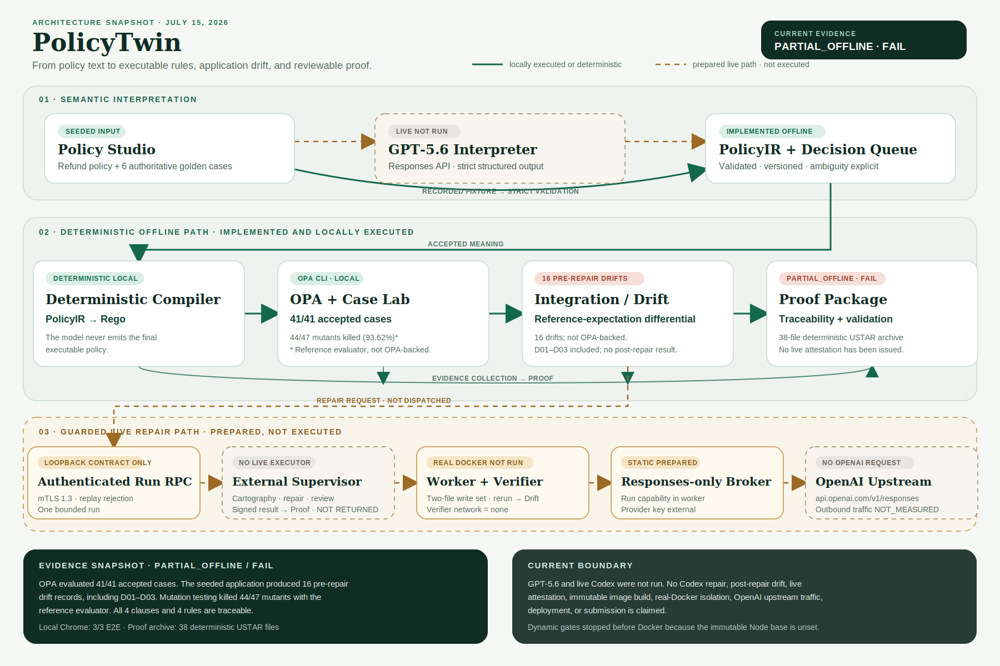

# PolicyTwin

**Turn policy text into verified product behavior.**

PolicyTwin is an evidence-first policy engineering product for OpenAI Build Week. It turns a natural-language SaaS refund policy into a versioned executable contract, exposes ambiguity and application drift, and produces reviewable proof.

## Current status

The repository now includes:

- strict `PolicyIR`, clause traceability, immutable ambiguity decisions, and SQLite-backed versions;
- a deterministic PolicyIR-to-Rego compiler and checksum-pinned OPA 1.18.2 execution over 41 accepted cases;
- boundary, conflict, contrast, differential, and mutation checks that expose all three seeded TypeScript defects;
- a server-only GPT-5.6 Responses adapter contract with strict structured output, full-source traceability, golden-case contradiction blocking, bounded retries, and a token-gated HTTP route;
- a server-only Codex SDK 0.144.3 adapter contract plus a real Node TLS 1.3 mutual-authentication transport and bounded supervisor service, with CA/name/certificate-pin/ALPN checks, canonical length frames, durable SQLite replay rejection, trusted supervisor signatures, host-known baseline/final tree-manifest comparison, a fixed two-file write set, and host live execution still disabled;
- static supervisor-owned worker/verifier/egress plans, a shell-free ID-owned Docker driver verified against a stateful fake daemon, and an OpenAI Responses-only reverse broker that gives the worker only a short-lived capability, keeps the provider credential in an external proxy mount, and remains explicitly non-live until the real Docker and SDK paths run;
- Policy Studio, an anonymous-session-isolated SQLite Decision Queue, Case Lab, Integration/Drift, Proof, and blocked Change Impact views in Next.js;
- Chrome E2E coverage for all six views, browser-session isolation, versioned decision/source writes, CSRF rejection, golden-conflict blocking, complete evidence downloads, keyboard navigation, and a 390px mobile layout;
- a complete, hash-covered `PARTIAL_OFFLINE` evidence package, adversarial semantic validation, a byte-deterministic 38-file USTAR download, and fail-closed submission drafts.

The repository is **not submission-ready**. Fresh GPT-5.6 and Codex runs, actual Codex repair evidence, dynamic container/egress proof, deployment, video, repository/submission URLs, an owner-selected project license, and confirmation are still missing. The evidence package therefore remains `FAIL / PARTIAL_OFFLINE` by design.

## Architecture

```mermaid
flowchart LR
  A["Refund policy + golden cases"] -.-> B["GPT-5.6 interpretation (live disabled)"]
  B --> C["Validated PolicyIR"]
  C --> D["Versioned ambiguity decisions"]
  D --> E["Deterministic Rego compiler"]
  E --> F["OPA + generated cases"]
  F --> G["TypeScript differential runner"]
  G --> H["Authentication-required single-run RPC"]
  H -.-> I["External Codex repair (live disabled)"]
  I -.-> J["Hash-covered live proof"]
  J -.-> K["Trusted live attestation"]
```



Dashed edges are planned live execution and have not run. Model output never becomes the final executable policy. The validated IR is compiled deterministically, every rule traces to source clauses, and golden-case contradictions fail closed.



## Local setup

Requirements:

- Node.js 22 or newer;
- pnpm 11.7 or newer;
- Chrome for E2E tests;
- OPA 1.18.2 at `.tools/opa/1.18.2/opa.exe` on Windows, or an explicit `OPA_PATH`.
- OpenSSL 1.1.1 or newer for ephemeral mTLS integration-test certificates; Git for Windows is auto-detected, or set `OPENSSL_PATH`.

```powershell
pnpm install --frozen-lockfile
pnpm opa:install
pnpm evidence:offline
pnpm dev
```

Open `http://localhost:3000`. Package installation and `pnpm opa:install` require network access on a new machine; the OPA installer downloads and verifies the official pinned binary. If the exact pnpm store is already populated, `pnpm install --offline --frozen-lockfile` is the deterministic offline alternative. If OPA is already installed, set `OPA_PATH` instead.

Copy `.env.example` to a local ignored environment file when exercising live integrations or overriding the local SQLite path:

| Variable | Purpose |
|---|---|
| `OPENAI_API_KEY` | Server-side Responses API access; a future live supervisor must mount the provider credential only into the egress broker, never the browser or worker |
| `OPENAI_MODEL` | Configurable model, default `gpt-5.6` |
| `CODEX_MODEL` | Required explicit model for live repair; no personal Codex default is inherited |
| `POLICYTWIN_RUN_TOKEN` | High-entropy token required by `POST /api/interpret` |
| `POLICYTWIN_ATTESTATION_PUBLIC_KEYS_JSON` | Trusted Ed25519 public-key map used to verify live evidence downloads; never a private key |
| `NEXT_PUBLIC_SITE_URL` | Absolute site URL used for metadata |
| `POLICYTWIN_PUBLIC_ORIGIN` | Exact browser-facing origin for workspace mutation checks; HTTPS is mandatory in production |
| `OPA_PATH` | Optional verified OPA executable override |
| `OPENSSL_PATH` | Optional OpenSSL executable override used only to generate temporary mTLS test certificates |
| `POLICYTWIN_DOCKER_CLI` | Canonical absolute Docker CLI path required by the worker and TLS-only dynamic gates; those gates force the platform-local daemon and do not search `PATH` |
| `POLICYTWIN_DATABASE_PATH` | Optional absolute SQLite file path; defaults to ignored `.data/policytwin.sqlite` |
| `POLICYTWIN_CODEX_*_TIMEOUT_MS` | Reserved values for the future external worker; the current host does not consume them |

Without `POLICYTWIN_RUN_TOKEN`, the live interpretation route returns `LIVE_RUN_DISABLED`. The host process cannot construct a live Codex backend: the exported live factory fails closed until a separate OS-sandbox worker RPC enforces the explicit key, model, empty per-run `CODEX_HOME`, managed fresh fixture, and process limits. No live model or Codex claim is made from recorded fixtures or fake-SDK tests.

## Verification

```powershell
pnpm lint
pnpm typecheck
pnpm test
pnpm test:integration
pnpm test:e2e
pnpm eval
pnpm build
pnpm demo:reset
pnpm demo:run
pnpm evidence:offline
pnpm security:check
pnpm clean:check
pnpm verify
pnpm verify:live
pnpm container:check
pnpm container:verify
pnpm worker:verify
pnpm egress:verify
pnpm submission:check
```

`pnpm demo:reset` removes only the default ignored demo SQLite file and restores the trusted fixture; stop the development server first on Windows. It fails closed when `POLICYTWIN_DATABASE_PATH` points elsewhere and never deletes that custom file. Browser sessions receive separate seeded projects; new sessions require same-origin fetch metadata, expire after 24 hours, and are capped at 128 per process. This is bounded demo isolation, not user authentication or a multi-instance storage design. `pnpm demo:run` must report exactly three seeded drifts. `pnpm verify` is the deterministic offline gate and runs the daemon-free static web/worker/verifier/egress contract. `pnpm container:verify` is the separate dynamic web image/OPA/non-root/read-only-root/health gate. `pnpm worker:verify` owns a fresh labeled internal network and worker/verifier containers only after returned Docker IDs pass identity inspection; its Linux dynamic path also requires Docker-ID-bound cgroup v2 teardown. `pnpm egress:verify` separately owns internal/outbound networks, the proxy, and a non-root TLS 1.3 probe. The probe closes after certificate verification without writing HTTP; the gate does not measure proxy outbound traffic and therefore does not claim upstream absence. All three dynamic gates currently fail before Docker because the immutable Node base is unset. A required CPU-controller port and fake-only BigInt ledger now aggregate post-baseline egress, worker, and verifier use under one request budget and hold both raw receipts until that static proof is complete. The proof explicitly says cumulative enforcement, a hard limit, bounded overshoot, and containment are false. It cannot satisfy `pnpm verify:live`, which also rejects an unbound report boolean; a real Linux cgroup controller, fresh GPT-5.6/Codex repair, and signed evidence are still absent.

Browser evidence is under `artifacts/screenshots/`. Machine-readable proof is under `artifacts/evidence/`; every unavailable live result is labeled `NOT_RUN` rather than simulated. The evidence API exposes every required artifact individually, and the Proof view builds `/api/evidence/archive` in memory from the exact 38-file allowlist, so transient files are never collected.

The downloadable USTAR package proves the seeded reference choices (`purchase day 0`, request-time usage, and default denial). It is byte-stable for the same package, uses the archive SHA-256 as its ETag, keeps the semantic evidence hash in a separate response header, and fails closed on missing, extra, tampered, credential-shaped, or personal-path content. Proof compares the browser session's validated PolicyIR meaning with that reference before showing a match, and Change Impact refuses to create v5 when the choices differ.

The SHA-256 manifest detects payload changes but is not an authenticity credential by itself. A future `LIVE_VERIFIED` package must also carry a fresh Ed25519 attestation over its evidence hash, run ID, and timestamp from a trusted `verify:live` key held outside the repository; the default verification window is 24 hours. The validator independently recomputes the compiler output, exact server-owned 41-case digest, accepted-case OPA agreement, differential records, mutation score, traceability, Codex command evidence, and structured GPT/browser/container/deployment/security proofs. Its canonical `integration.diff` must byte-for-byte match the content changes reconstructed from the attested before/after fixture receipts.

`pnpm clean:check` validates a source-only copy against the current machine's existing pnpm store, verified OPA path, and Chrome installation. It is not a claim that a network-disconnected fresh machine already has those prerequisites.

## Safety boundary

Only the bundled trusted refund fixture may be executed or modified. Uploaded or arbitrary repositories are never executed by the hosted flow. Secrets, absolute personal paths, and live credentials are excluded from evidence and screenshots.

Codex phases use distinct SDK threads. Cartography and review are read-only and fail if the fixture changes; repair uses workspace-write with network and web search disabled. Before any SDK turn, the adapter rejects sensitive or personal-path content in the complete trusted context and every canonical NUL-free UTF-8 fixture file. It rejects every SDK `command_execution` lifecycle event, so only the orchestrator may run the two fixed verification commands, and it rejects sensitive command output at the contract boundary. Model output cannot expand writes beyond `src/refund.ts` and `tests/refund.test.mjs`, nor set SDK provenance, changed files, command receipts, regression claims, or policy-verification results. Server-owned metadata binds the prompt template, complete request, and output schema hashes. The repair must enable the exact digest-pinned D01-D03 assertions already present as skipped tests, while the server requires the exact hash-bound golden-plus-generated 41-case corpus. It derives changes from fixture snapshots, retains successful results and runner/evidence failures for every attempt, and rejects any test that changes file content, structure, mode, or mtime after typecheck. A failed write phase poisons the disposable workspace so no later phase can reuse it. The server then evaluates all 41 cases through a separate trusted runner whose receipt is bound to the attempt, repair run, final execution tree, accepted corpus, and PolicyIR. The executed exact tests plus the 41-case receipt—not model prose or a reported link—are the regression proof. Missing, altered, erroring, or non-passing results block review.

The SDK sandbox is not treated as a host read jail. No web-process route invokes the live adapter, the host live-backend factory always rejects, and the local command runner rejects `LIVE_CODEX_SDK` outright. The repository now has a concrete Node TLS 1.3 client and supervisor service: both peers must chain to the configured CA, match pinned SHA-256 certificate fingerprints, negotiate the fixed ALPN, and the server certificate must match the fixed name. The wire protocol accepts exactly one bounded magic-plus-length canonical JSON request and response per connection. The supervisor rejects malformed, partial, oversized, trailing, replayed, expired, and concurrent requests before execution; a durable SQLite replay store rejects reuse of either request ID or nonce across restarts. Cancellation and supervisor shutdown abort the injected executor and wait for it to settle, while pre-handshake sockets are tracked and destroyed. The host then applies the existing 4 MiB/64 KiB/1,024-chunk, Ed25519, policy/image/corpus, tree-manifest, command, and teardown checks.

This proves local contracts only. The integration executor returns an explicitly labeled signed `FAIL` test result and performs no SDK work. Separate non-root worker, verifier, and egress Dockerfiles exist with immutable build-input hashes. A prepared entrypoint validates a canonical request and empty `CODEX_HOME` but can emit only `VALIDATED_REQUEST_LIVE_DISABLED`. Docker v2 derives every resource name and exact PolicyTwin labels from the request plus an independent nonce; existing names are never adopted, and a returned 64-hex ID grants cleanup authority only after independent ID/name/label inspection. The runner pins a canonical Docker executable and the platform-local daemon; the observer closes entrypoint, working directory, environment, namespaces, devices, security controls, bind propagation, tmpfs, ports, exact network membership, and an explicit `restart=no` policy. Stateful fake-daemon tests cover normal execution, name preemption, ambiguous/foreign IDs, partial creation, foreign endpoints, observer drift, published ports, swap/file/log limit drift, and sealed-image/maximum-limit admission. The supervisor pins each running container's ID/PID/start timestamp with zero restarts and reobserves the exact egress instance before and after worker execution and before proxy stop, so a stopped or replaced proxy invalidates the worker result. Init-PID-only procfs evidence is rejected; real dynamic teardown requires cgroup v2 plus initial-PID absence. The supervisor seals the worker image and maximum request limits. Runtime memory and swap are equal, regular-file writes inherit the request output ceiling, and the local Docker log uses the same maximum size with one file. One prepare/worker/verifier execution deadline is request-bound and teardown uses a separate bounded grace period. The CPU controller is a required lifecycle dependency: the current fake controller creates an exact request/binding/identity proof over one aggregate budget, and worker/verifier JSON stays an untrusted wrapper until the proof finalizes. Controller cleanup failure poisons the lifecycle. This does not sample real `cpu.stat`, poll, freeze, kill, bound overshoot, or enforce cumulative time, so real Linux evidence remains a live blocker. The reverse broker still admits only bounded `POST /v1/responses`, consumes a run-bound capability, resolves the fixed upstream to public IPv4, pins the connection while preserving OpenAI SNI/certificate identity, and rejects redirects or compression. No immutable image or real Docker path has run here; the TLS-only report is fail-closed and explicitly marks proxy outbound traffic `NOT_MEASURED`, the host live factory still rejects, and no live PASS response or Codex repair exists.

The repository now also defines a contract-only Worker RPC v2 envelope for future live Linux CPU evidence. It has a separate protocol, Ed25519 signature domain, TLS ALPN/frame magics, structured `LIVE_LINUX_CGROUP_RPC_V2` trust entries, key material distinct from v1, mutual TLS only, and a durable SQLite replay requirement. Required `cpuEvidence` schema v2 binds the client-derived execution identity, request, image, policy, corpus, role identities, and one strictly ordered `CLOCK_MONOTONIC_RAW_NS` event transcript. Success is recomputed from exact egress/worker overlap, verifier-after-egress ordering, linked samples, aggregate arithmetic, controller stop, and cgroup release. Closed FAIL outcomes distinguish pre-execution rejection, non-CPU execution failure, controller failure, observed over-budget containment, and incomplete containment; partial attempts cannot claim a complete Docker binding. A non-exported synthetic contract producer now serializes those events, derives hashes and arithmetic, exercises overage and cleanup failures, and returns only a frozen `UNSIGNED_CPU_EVIDENCE_V2_CANDIDATE` with `liveClaim:false` and `passSigningEligible:false`. It rejects self-declared Linux provenance. The legacy role-local proof v1, static fake objects, nullable `cpuProof` receipts, unsigned input, replay, key reuse, and downgrade are rejected by this wire profile. The generic supervisor still refuses PASS. Synthetic success and failure fixtures use test keys, while the real loopback v2 integration signs only typed pre-execution `FAIL`; neither is Linux runtime evidence. No real Linux system adapter, dedicated live lifecycle, Docker run, `cpu.stat` observation, containment action, model call, or Codex repair is claimed, and hard-limit plus bounded-overshoot claims remain false.

Worker RPC v2 transport admission also uses a factory-identity capability: the concrete v2 mTLS client module owns a private `WeakSet`, snapshots every validated scalar option, defensively copies CA/certificate/key buffers and CA arrays, and only its actual v2 factory freezes and adds the exact object that the client accepts. There is no arbitrary registrar; the assertion module is absent from the root package. Self-declared, v1, copied, wrapped, or post-construction option-mutated transports cannot change the admitted connection profile before request creation. This hardens the local host boundary only; it does not change the FAIL-only supervisor or create live evidence.

Self-rehashing an edited evidence package cannot promote it to `LIVE_VERIFIED`: live status requires both semantic consistency and a trusted detached signature. No private attestation key belongs in this repository.

PolicyTwin is a software verification aid, not legal advice. Real policy deployment requires human approval.

Read `AGENTS.md`, `PLAN.md`, `PROGRESS.md`, `DECISIONS.md`, and `SUBMISSION.md` before changing the implementation.
