# PolicyTwin

**Turn policy text into verified product behavior.**

PolicyTwin is an evidence-first policy engineering product for OpenAI Build Week. It turns a natural-language SaaS refund policy into a versioned executable contract, exposes ambiguity and application drift, and produces reviewable proof.

## Current status

The repository now includes:

- strict `PolicyIR`, clause traceability, immutable ambiguity decisions, and SQLite-backed versions;
- a deterministic PolicyIR-to-Rego compiler and checksum-pinned OPA 1.18.2 execution over 41 accepted cases;
- boundary, conflict, contrast, differential, and mutation checks that expose all three seeded TypeScript defects;
- a server-only GPT-5.6 Responses adapter contract with strict structured output, full-source traceability, golden-case contradiction blocking, bounded retries, and a token-gated HTTP route;
- a server-only Codex SDK 0.144.3 adapter contract plus a bounded external-worker RPC client contract with a required transport-authentication mode, streamed preallocation/chunk limits, single-use request capabilities, trusted supervisor signatures, host-known baseline/final tree-manifest comparison, a fixed two-file write set, and host live execution still disabled;
- Policy Studio, an anonymous-session-isolated SQLite Decision Queue, Case Lab, Integration/Drift, Proof, and blocked Change Impact views in Next.js;
- Chrome E2E coverage for all six views, browser-session isolation, versioned decision/source writes, CSRF rejection, golden-conflict blocking, complete evidence downloads, keyboard navigation, and a 390px mobile layout;
- a complete, hash-covered `PARTIAL_OFFLINE` evidence package, adversarial semantic validation, a byte-deterministic 38-file USTAR download, and fail-closed submission drafts.

The repository is **not submission-ready**. Fresh GPT-5.6 and Codex runs, actual Codex repair evidence, container health, deployment, video, repository/submission URLs, an owner-selected project license, and confirmation are still missing. The evidence package therefore remains `FAIL / PARTIAL_OFFLINE` by design.

## Architecture

```mermaid
flowchart LR
  A["Refund policy + golden cases"] --> B["GPT-5.6 interpretation"]
  B --> C["Validated PolicyIR"]
  C --> D["Versioned ambiguity decisions"]
  D --> E["Deterministic Rego compiler"]
  E --> F["OPA + generated cases"]
  F --> G["TypeScript differential runner"]
  G --> H["Authentication-required single-run RPC"]
  H --> I["External Codex repair + immutable verification"]
  I --> J["Hash-covered proof package"]
  J --> K["Trusted live attestation"]
```



Model output never becomes the final executable policy. The validated IR is compiled deterministically, every rule traces to source clauses, and golden-case contradictions fail closed.

## Local setup

Requirements:

- Node.js 22 or newer;
- pnpm 11.7 or newer;
- Chrome for E2E tests;
- OPA 1.18.2 at `.tools/opa/1.18.2/opa.exe` on Windows, or an explicit `OPA_PATH`.

```powershell
pnpm install --frozen-lockfile
pnpm opa:install
pnpm evidence:offline
pnpm dev
```

Open `http://localhost:3000`. Package installation and `pnpm opa:install` require network access on a new machine; the OPA installer downloads and verifies the official pinned binary. If the exact pnpm store is already populated, `pnpm install --offline --frozen-lockfile` is the deterministic offline alternative. If OPA is already installed, set `OPA_PATH` instead.

Copy `.env.example` to a local ignored environment file when exercising live integrations or overriding the local SQLite path:

| Variable | Purpose |
|---|---|
| `OPENAI_API_KEY` | Server-side Responses API access; never expose to the browser |
| `OPENAI_MODEL` | Configurable model, default `gpt-5.6` |
| `CODEX_API_KEY` | Future external-worker-only Codex access; never set in the web image, sent over RPC, or passed to fixture commands |
| `CODEX_MODEL` | Required explicit model for live repair; no personal Codex default is inherited |
| `POLICYTWIN_RUN_TOKEN` | High-entropy token required by `POST /api/interpret` |
| `POLICYTWIN_ATTESTATION_PUBLIC_KEYS_JSON` | Trusted Ed25519 public-key map used to verify live evidence downloads; never a private key |
| `NEXT_PUBLIC_SITE_URL` | Absolute site URL used for metadata |
| `POLICYTWIN_PUBLIC_ORIGIN` | Exact browser-facing origin for workspace mutation checks; HTTPS is mandatory in production |
| `OPA_PATH` | Optional verified OPA executable override |
| `POLICYTWIN_DATABASE_PATH` | Optional absolute SQLite file path; defaults to ignored `.data/policytwin.sqlite` |
| `POLICYTWIN_CODEX_*_TIMEOUT_MS` | Reserved values for the future external worker; the current host does not consume them |

Without `POLICYTWIN_RUN_TOKEN`, the live interpretation route returns `LIVE_RUN_DISABLED`. The host process cannot construct a live Codex backend: the exported live factory fails closed until a separate OS-sandbox worker RPC enforces the explicit key, model, empty per-run `CODEX_HOME`, managed fresh fixture, and process limits. No live model or Codex claim is made from recorded fixtures or fake-SDK tests.

## Verification

```powershell
pnpm lint
pnpm typecheck
pnpm test
pnpm test:integration
pnpm test:e2e
pnpm eval
pnpm build
pnpm demo:reset
pnpm demo:run
pnpm evidence:offline
pnpm security:check
pnpm clean:check
pnpm verify
pnpm verify:live
pnpm container:check
pnpm container:verify
pnpm submission:check
```

`pnpm demo:reset` removes only the default ignored demo SQLite file and restores the trusted fixture; stop the development server first on Windows. It fails closed when `POLICYTWIN_DATABASE_PATH` points elsewhere and never deletes that custom file. Browser sessions receive separate seeded projects; new sessions require same-origin fetch metadata, expire after 24 hours, and are capped at 128 per process. This is bounded demo isolation, not user authentication or a multi-instance storage design. `pnpm demo:run` must report exactly three seeded drifts. `pnpm verify` is the deterministic offline gate and runs the daemon-free static container contract. `pnpm container:verify` is the separate dynamic image/OPA/non-root/read-only-root/health gate; it initializes the named volume for the non-root runtime, persists an actual workspace decision through the API, restarts the container, and reads the same SQLite state back. It currently fails before build because the immutable Node base-image digest is unset; the Docker daemon also remains unavailable but is reached only after that fail-closed precondition. `pnpm verify:live` must capture fresh GPT-5.6 and Codex evidence before completion.

Browser evidence is under `artifacts/screenshots/`. Machine-readable proof is under `artifacts/evidence/`; every unavailable live result is labeled `NOT_RUN` rather than simulated. The evidence API exposes every required artifact individually, and the Proof view builds `/api/evidence/archive` in memory from the exact 38-file allowlist, so transient files are never collected.

The downloadable USTAR package proves the seeded reference choices (`purchase day 0`, request-time usage, and default denial). It is byte-stable for the same package, uses the archive SHA-256 as its ETag, keeps the semantic evidence hash in a separate response header, and fails closed on missing, extra, tampered, credential-shaped, or personal-path content. Proof compares the browser session's validated PolicyIR meaning with that reference before showing a match, and Change Impact refuses to create v5 when the choices differ.

The SHA-256 manifest detects payload changes but is not an authenticity credential by itself. A future `LIVE_VERIFIED` package must also carry a fresh Ed25519 attestation over its evidence hash, run ID, and timestamp from a trusted `verify:live` key held outside the repository; the default verification window is 24 hours. The validator independently recomputes the compiler output, exact server-owned 41-case digest, accepted-case OPA agreement, differential records, mutation score, traceability, Codex command evidence, and structured GPT/browser/container/deployment/security proofs. Its canonical `integration.diff` must byte-for-byte match the content changes reconstructed from the attested before/after fixture receipts.

`pnpm clean:check` validates a source-only copy against the current machine's existing pnpm store, verified OPA path, and Chrome installation. It is not a claim that a network-disconnected fresh machine already has those prerequisites.

## Safety boundary

Only the bundled trusted refund fixture may be executed or modified. Uploaded or arbitrary repositories are never executed by the hosted flow. Secrets, absolute personal paths, and live credentials are excluded from evidence and screenshots.

Codex phases use distinct SDK threads. Cartography and review are read-only and fail if the fixture changes; repair uses workspace-write with network and web search disabled. Before any SDK turn, the adapter rejects sensitive or personal-path content in the complete trusted context and every canonical NUL-free UTF-8 fixture file. It rejects every SDK `command_execution` lifecycle event, so only the orchestrator may run the two fixed verification commands, and it rejects sensitive command output at the contract boundary. Model output cannot expand writes beyond `src/refund.ts` and `tests/refund.test.mjs`, nor set SDK provenance, changed files, command receipts, regression claims, or policy-verification results. Server-owned metadata binds the prompt template, complete request, and output schema hashes. The repair must enable the exact digest-pinned D01-D03 assertions already present as skipped tests, while the server requires the exact hash-bound golden-plus-generated 41-case corpus. It derives changes from fixture snapshots, retains successful results and runner/evidence failures for every attempt, and rejects any test that changes file content, structure, mode, or mtime after typecheck. A failed write phase poisons the disposable workspace so no later phase can reuse it. The server then evaluates all 41 cases through a separate trusted runner whose receipt is bound to the attempt, repair run, final execution tree, accepted corpus, and PolicyIR. The executed exact tests plus the 41-case receipt—not model prose or a reported link—are the regression proof. Missing, altered, erroring, or non-passing results block review.

The SDK sandbox is not treated as a host read jail. No web-process route invokes the live adapter, the host live-backend factory always rejects, and the local command runner rejects `LIVE_CODEX_SDK` outright. The host RPC contract requires a transport to declare mTLS or protected local-socket ACL, but the current repository has no transport implementation and therefore does not yet prove authentication. Its client accepts only a declared-length asynchronous byte stream, rejects the body before allocation when the length exceeds 4 MiB, limits each chunk to 64 KiB and the frame to 1,024 chunks, then validates canonical UTF-8/JSON. It binds the response to a one-use nonce/request/policy/image digest, verifies a pinned Ed25519 supervisor key, compares host-known baseline and signed final path/kind/mode/mtime/file-hash manifests so exactly the two allowed files changed, requires immutable command/corpus tree receipts, and rejects missing process-tree/workspace teardown. The future supervisor may expose only an OpenAI-specific egress proxy to the SDK; fixture commands and corpus verification remain non-networked. No transport, supervisor, worker image, or live response exists yet, so `pnpm verify:live` remains fail-closed.

Self-rehashing an edited evidence package cannot promote it to `LIVE_VERIFIED`: live status requires both semantic consistency and a trusted detached signature. No private attestation key belongs in this repository.

PolicyTwin is a software verification aid, not legal advice. Real policy deployment requires human approval.

Read `AGENTS.md`, `PLAN.md`, `PROGRESS.md`, `DECISIONS.md`, and `SUBMISSION.md` before changing the implementation.
