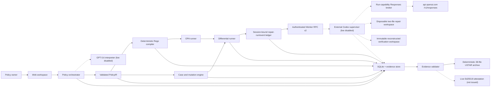

# PolicyTwin architecture

Status: partial offline implementation. Dashed responsibilities require approved external integration.

Implemented offline:

- strict refund input validation plus one Zod-defined `PolicyIR` structural contract shared by runtime admission, the generated checked-in JSON Schema, and the model-owned Responses Structured Outputs projection. Server-owned metadata/input schema are excluded from model output and injected only after the projection passes locally. Explicit refusal, incomplete, error, failed, cancelled, queued, and in-progress outcomes terminate after one attempt; only recoverable JSON/schema/semantic output defects use the bounded second attempt. Deterministic semantic validation still owns references, field/value compatibility, exact input schema, source coverage, patches, and golden-case agreement;
- explicit ambiguity patches and state transitions;
- deterministic Rego source generation;
- policy-derived cases, conflicts, contrasts, and mutation execution;
- reference differential reports for canonical and evaluation-only fixtures;
- guarded repair-worker contracts, isolated trusted copies, a pinned server-side Codex SDK-compatible adapter contract, and a Node TLS 1.3 mutual-authentication client/supervisor with fixed CA/name/certificate pins/ALPN, one bounded canonical request/response frame, a durable SQLite request-ID/nonce replay store, single-active-run cancellation, immutable image/baseline/corpus bindings, baseline/final tree-manifest delta validation, and trusted Ed25519 supervisor receipts;
- an internal Worker RPC v2 unsigned execution core that parses and freezes one canonical request, checks its current validity and source hash before and after every injected backend/verifier call, fixes typecheck-before-test and complete-corpus-before-review ordering, rejects sensitive content across the completed report, and binds the resulting offline report hash. The module is absent from the root barrel, rejects `LIVE_CODEX_SDK` backends and extra authority fields, truthfully labels the structural port `UNVERIFIED_INJECTED_BACKEND`, and returns only a deeply frozen `UNSIGNED_WORKER_EXECUTION_CANDIDATE` whose live, PASS-signing, and external-settlement eligibility flags are false. It is deliberately not wired into `worker-entrypoint.mjs`, the Docker role target, a Worker RPC response, or the repair-run ledger;
- a separate internal verifier-corpus pre-authority contract that executes the accepted 41-case loop through an injected evaluator while refusing to call the result server-owned evidence. One active canonical v2 request is revalidated around every case. Canonical policy/result hashes, caller-supplied attempt/run and command transcript, and one unchanged caller-observed typecheck/test tree are bound into distinctly named unverified input and result digests. The candidate explicitly marks evaluator, attempt/run, command, tree, and injected-clock authority unverified, is absent from the root barrel, and cannot become `PolicyVerificationEvidence`, a v2 response, a validated external run, or settlement. Static contract inspection parses TypeScript/JavaScript modules, resolves supported import/re-export/require edges and configuration mappings, and rejects non-literal direct loaders plus common indirect `require` constructions. Its status is explicitly static graph evidence, not runtime proof;
- a non-runtime verifier exchange authority that recursively observes exact source/build manifests, seals one initial snapshot, issues one 256-bit in-process capability, authenticates a fully bound receipt with domain-separated HMAC, and stores only capability/receipt digests in a STRICT SQLite replay database. Durable request-attempt tombstones survive challenge expiry until request expiry, and a persisted clock high-water mark rejects rollback across restart. PASS creates one receipt-bound structural review authorization; FAIL attempt 1 creates one fresh-snapshot retry; all output is `BOUND_NOT_RUNTIME_FINALIZED`. The four modules are not root-exported or production-connected, and static inspection covers their supported imports plus common loader/code-generation edges while explicitly remaining non-runtime proof;
- change impact, traceability, aggregate evidence hashes, exact source-derived evaluation-scorecard values/targets/statuses, semantic cross-checks, a closed byte-deterministic 38-file USTAR download, and a trusted live-attestation boundary. The exact seeded policy ID/version/source hash, fully resegmented clauses, ambiguity source links, and closed patches gate deterministic server-owned ambiguity wording/examples; non-seeded or changed inputs bypass this canonicalization;
- SQLite-backed policy, version, lifecycle, golden-case, and decision persistence with restart recovery;
- a separate SQLite repair-run/event ledger keyed by a one-way session binding and idempotent client request ID. Same-origin/CSRF-protected creation accepts only the current exact seeded reference PolicyIR; GET and SSE reads require the same HttpOnly session. One singleton authority row stores the owner, random fence, durable generation, heartbeat expiry, and clock high-water. Admission, active writes, terminal state/event/release, and expired-owner reconciliation are transactional; schema-v2 insert/update generation triggers also fence already-open v1 writers. Event sequences are bounded, phase start/completion ordering is closed, and `Last-Event-ID` resumes without replaying prior entries. An unexpired lease is observed without a writer transaction, while expired running or cleanup-pending work becomes `POISONED`. The local `rr_<32 hex>` suffix is the signed v2 request ID, and stored success provenance retains that request ID, execution-binding digest, and completion time;
- framework-independent workspace orchestration for current-state reads, immutable text versions, and atomic ambiguity resolution;
- checksum-pinned OPA 1.18.2 compile/evaluation over all 41 accepted cases;
- a six-view Next.js workspace with real versioned decision/source writes, health/evidence/interpret/workspace/repair-run/SSE routes, and local Chrome E2E coverage. Integration shows empty, loading, blocked, running, cleanup-pending, failed, poisoned, and admitted-result surfaces without turning a blocked audit record into a model-call claim. On Windows, a UUID-scoped `.tmp` signal/acknowledgement handshake stops the Playwright-owned standalone server only after the server acknowledges the request and health remains down;
- a fail-closed standalone web Dockerfile contract that excludes the live Codex worker and requires an immutable Node image digest before dynamic build. Its dynamic verifier accepts only a canonical absolute Docker CLI whose bytes match a separately reviewed contract SHA-256, rehashes it before every invocation, forces the platform-local daemon through a closed environment, requires the base digest locally, and passes `--pull=false`. A 128-bit nonce binds the image, volume, and four setup/runtime roles to exact labels; create results remain non-authoritative until independently inspected. Every role is observed before start with `restart=no`, zero restarts, a read-only root, no privilege escalation, PID 64, equal 1 GiB memory/swap, one CPU, a 16 MiB file limit, and one 16 MiB local log. Later operations use observed identities and cleanup requires final absence;
- separate static worker/verifier/egress Dockerfiles and deterministic lifecycle contracts that fix non-root users, read-only roots, dropped capabilities, resource ceilings, a read-only baseline plus exactly two writable file overlays, a credential-free `network=none` verifier, and external-only broker secrets;
- a shell-free static Docker driver that pins a canonical Docker executable and local daemon, derives per-run names and exact labels from the request plus a 128-bit supervisor nonce, promotes returned 64-hex IDs only after independent identity inspection, performs every later operation by ID, and closes container/network/port/mount/namespace/environment observations. Every process explicitly uses `restart=no`; inspect requires zero restarts, and the driver pins ID/PID/start timestamp then reobserves the same running egress instance around worker execution and before stop. The supervisor seals the worker image and request maxima. Memory and swap are equal; PID, per-file output, and one-file local-log limits plus one prepare/worker/verifier execution deadline are request-bound and independently inspected. Cleanup has a separate bounded grace period. A required CPU-controller port now holds worker/verifier receipts as raw JSON until a fake-only BigInt ledger finalizes one request/binding/identity-bound aggregate over egress, worker, and verifier. Its proof keeps enforcement, hard-limit, overshoot, and containment claims false, and cleanup failure poisons the lifecycle. This older static/fake-driver path implements no real `cpu.stat` sampling, polling, freeze, or kill. Stateful fake-daemon/controller tests prove ordering and fail-closed cleanup. The separate schema-v10 non-live observer requires an exact Docker cgroup path, cgroup-v2 filesystem, private directory descriptor plus device/inode identity, full uint64 `bigint` samples, `populated=0` subtree quiescence, initial-PID absence, original-cgroup release, and sticky teardown-action results for `worker:verify` and `egress:verify`; it has only offline contract coverage, takes its baseline after start, and is distinct from the private v13 construction;
- a contract-only Worker RPC v2 and CPU evidence schema v2. V2 separates protocol/signature/ALPN/frame from v1, requires mutual TLS plus durable replay, and rejects live keys whose Ed25519 material overlaps the general v1 registry. Required `cpuEvidence` binds request/execution/image/policy/corpus and either a global monotonic three-role success transcript or a closed failure outcome. Success is derived from exact lifecycle/sample linkage, egress-worker overlap, verifier ordering, arithmetic, stop, and release; failure branches bind partial attempts, containment actions/results, and remaining processes without inventing a complete Docker binding. An internal synthetic-only producer serializes this state machine and emits frozen unsigned/non-live wrappers whose current signing eligibility is false. It is absent from the package barrel and rejects self-declared Linux provenance; its raw parser-valid evidence is contract data, not provenance or authorization. The generic supervisor remains fail-only. A concrete private Linux construction now exists, but no finalized result from it feeds this contract;
- a schema-v15 private Linux construction that retains the v10 observer, v11 final-result guard, and v12 barrier/helper boundaries. One deeply frozen lifecycle-v3 plan closes the immutable role images, exact role configuration, run labels, limits, mounts, intended network topology, and the helper artifact image/source/build/binary identities; copied or caller-shaped plans are rejected by object identity. The Docker owner snapshots the sealed helper binary hash, and the system adapter rejects a same-FD helper client with any other hash. A required digest-pinned compiler stage builds fixed strict C17 input into one root-owned `0555` AMD64 static PIE in a scratch artifact image. Direct ELF/tar validation rejects interpreters, shared-library dependencies, executable stacks, wrong type/architecture, oversized output, ownership drift, and mode drift. The local WSL compiler produced two byte-identical files, but remains explicitly unpinned and non-promotable. The dynamic artifact gate uses `--pull=false` and `--network=none` and currently stops before Docker because no immutable builder image is configured. The Docker owner otherwise creates and independently inspects both networks, derives role plans only from their observed IDs, creates roles held behind barriers, binds and reobserves identities, serially samples and contains, removes Docker roles before cgroups, and proves final container/network absence. Create failures that may follow side effects can recover only one exact-name, exact-label owned resource for cleanup; empty, foreign, or ambiguous observations remain sticky failures. The static gates do not invoke this construction, and artifact-image reproducibility, host installation, cgroup-v2 execution, cross-UID barrier/FD behavior, final issuance, signer admission, and live verification remain false;
- an identity-only v2 transport capability. The concrete v2 mTLS client module owns a private `WeakSet`; its actual factory validates and snapshots scalar options, defensively copies CA/certificate/key buffers and CA arrays, freezes and adds only the resulting transport, and exposes no arbitrary registrar. The client rejects self-declared, v1, copied, and wrapped transports before request construction, while caller mutation after construction cannot change the private connection snapshot. Scripted response-validation fixtures and supervisor integration both use real TLS 1.3 loopback peers plus the concrete factory;
- a prepared worker entrypoint that validates the canonical RPC request, empty fixed `CODEX_HOME`, proxy token, and CA mount but can emit only a non-live disabled receipt; command-backed Codex provider authentication reads a 256-bit per-run capability rather than a provider credential;
- a Responses-only reverse-broker implementation and local fake-upstream integration test. It fixes method/path/authority, request and response byte limits, bounded lease use, header/framing rules, no redirects or compression, public-IPv4 DNS selection, a pinned IP connection, and OpenAI SNI/certificate/Host identity. This remains static/offline evidence until the prepared container and real upstream path run.

Proof and Change Impact are bound to the recorded reference policy by a deterministic semantic fingerprint covering version, clauses, rules, ambiguity selections, defaults, normalization, and the input schema. Opaque per-session IDs and model provenance are excluded from that equality check. A mismatch is shown explicitly and blocks the reference 14-to-30 draft; it never re-labels the static evidence or its archive as proof for a different session policy. The archive route reads no directory listing: it loads exactly `REQUIRED_EVIDENCE_FILES`, validates the full package and any live attestation, rejects sensitive content, and emits fixed USTAR headers and ordering in memory.

Not yet authoritative:

- GPT-5.6 and Codex nodes still require fresh credentialed execution and signed live evidence. The product repair-run port is deliberately unavailable, so current UI attempts terminate as durable `BLOCKED / NOT_STARTED` records. The new v2-bound unsigned execution core exercises only injected offline doubles and supervisor/verifier ports; it neither constructs the real SDK nor issues an RPC response or settlement. The mTLS transport and bounded supervisor are verified on real loopback sockets with ephemeral certificates, but v1 and v2 injected integration executors emit only explicit signed `FAIL` test results. A run cannot transition to success from a shaped object: only the exact branded v2 client may bind the local run ID into the signed request, consume the authenticated result, and issue one fresh settlement object. The ledger independently rechecks run ID, input, completion time, fixed files/commands, complete corpus, teardown, and review before success. Timeouts enter cleanup-pending; normal rejection, transport loss, invalid or replayed settlement, ignored abort, and restart all remain `POISONED` unless a run-bound authenticated cleanup-complete settlement is admitted. A concrete Docker driver now connects the generic lifecycle to fixed commands and supervisor observations, but only through fake-runner tests; it is not enabled as a signed live executor. The web, worker/verifier, and TLS-only egress dynamic gates currently fail before Docker at unset immutable identities. The observed Docker Desktop daemon also uses cgroup v1; worker and egress now require a canonical Linux cgroup-v2 supervisor before builds and would reject this host even after image pinning. That preflight does not replace Docker-ID-bound cgroup and teardown evidence. Worker RPC v2 can carry strictly parsed signed CPU evidence v2, and the internal synthetic producer can build only wrappers ineligible for current signing/admission; no real Linux controller produces evidence and the live gate still admits none. The probe writes no HTTP and performs no SDK turn, but proxy outbound traffic is not measured; the host live-backend factory still rejects;
- the 14-to-30 impact candidate is a persisted text-only `DRAFT`; it is not accepted PolicyIR and remains blocked by G02;
- mutation execution remains reference-based rather than OPA-backed;
- the web, worker, verifier, and egress Dockerfiles and daemon-free static checks exist, but their image digests, dynamic container health/isolation, actual TLS probe, live OpenAI/Codex path, deployed browser run, and deployment do not.

The offline persistence adapters use Node.js 22's built-in experimental `node:sqlite` API behind distinct policy and repair-run databases. Each anonymous browser session maps to a hashed internal project ID and a full SHA-256 run binding; raw session tokens are not stored in the run ledger. Only same-origin browser fetches may create a session. Policy schema v3 migrates v1/v2, reserves that namespace, assigns a random immutable storage generation, rejects stale ID-only deletion, and serializes exact-duplicate checking, the 128-project count, project insertion, and v1 insertion in one `BEGIN IMMEDIATE` transaction across processes sharing one policy file. Generation-fenced deletion inserts an ID/generation retirement tombstone in that same transaction; database triggers require it for deletion and reject later insertion or ID reassignment, so an expired token-derived ID remains retired across restart. Tombstones are excluded from active capacity but retained permanently, with growth bounded by at most the configured capacity per 24-hour expiry cycle. Expiry cleanup and repair POST admission both acquire the same policy-generation writer lock before the repair database; a stale generation has no side effect, cleanup-first rejects delayed admission, and admission-first exposes the durable run row before cleanup can decide. Cleanup retains the expired slot only for `QUEUED`, `RUNNING`, `CLEANUP_PENDING`, or `POISONED`; a readiness failure can make the row terminal `BLOCKED` and later prunable. A session retains at most 16 attempts. The repair executor admits only one queued, running, cleanup-pending, or poisoned run across every process that shares the same durable repair-run database file. Processes with separate local files are not coordinated, policy and repair-run cleanup is not cross-database atomic, direct database-file access is trusted operator authority, and no network-filesystem or distributed-database lock claim is made. Session expiry cascade-deletes only safe terminal `BLOCKED`, `FAILED`, and `SUCCEEDED` history, while active or poisoned rows remain as a global fail-stop latch until reset/operator recovery. Public-origin and HTTPS configuration is validated before project creation, and every mutation rechecks server-side expiry inside the shared write gate before reading the current version. Browser mutations accept only the public seeded policy ID, version path, and closed option/source/run body; an exact configured production origin, an HttpOnly SameSite session and CSRF cookie, a matching custom header, byte and ten-second body limits, and a single-process write gate protect the route. Production readiness remains unclaimed until authentication, shared quotas, the selected container runtime, backup behavior, distributed storage coordination, and deployment persistence volume are verified.

The application boundary accepts only the bundled `seeded-refund-demo` fixture for write execution. Policy text is untrusted semantic input; it never becomes executable code directly.
