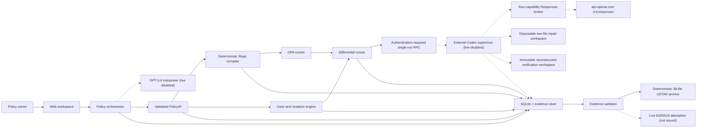

# PolicyTwin architecture

Status: partial offline implementation. Dashed responsibilities require approved external integration.

Implemented offline:

- strict refund input and `PolicyIR` validation;
- explicit ambiguity patches and state transitions;
- deterministic Rego source generation;
- policy-derived cases, conflicts, contrasts, and mutation execution;
- reference differential reports for canonical and evaluation-only fixtures;
- guarded repair-worker contracts, isolated trusted copies, a pinned server-side Codex SDK-compatible adapter contract, and a Node TLS 1.3 mutual-authentication client/supervisor with fixed CA/name/certificate pins/ALPN, one bounded canonical request/response frame, a durable SQLite request-ID/nonce replay store, single-active-run cancellation, immutable image/baseline/corpus bindings, baseline/final tree-manifest delta validation, and trusted Ed25519 supervisor receipts;
- change impact, traceability, aggregate evidence hashes, semantic cross-checks, a closed byte-deterministic 38-file USTAR download, and a trusted live-attestation boundary;
- SQLite-backed policy, version, lifecycle, golden-case, and decision persistence with restart recovery;
- framework-independent workspace orchestration for current-state reads, immutable text versions, and atomic ambiguity resolution;
- checksum-pinned OPA 1.18.2 compile/evaluation over all 41 accepted cases;
- a six-view Next.js workspace with real versioned decision/source writes, health/evidence/interpret/workspace routes, and local Chrome E2E coverage.
- a fail-closed standalone web Dockerfile contract that excludes the live Codex worker and requires an immutable Node image digest before dynamic build;
- separate static worker/verifier/egress Dockerfiles and deterministic lifecycle contracts that fix non-root users, read-only roots, dropped capabilities, resource ceilings, a read-only baseline plus exactly two writable file overlays, a credential-free `network=none` verifier, and external-only broker secrets;
- a shell-free Docker driver that pins a canonical Docker executable and local daemon, derives per-run names and exact labels from the request plus a 128-bit supervisor nonce, promotes returned 64-hex IDs only after independent identity inspection, performs every later operation by ID, and closes container/network/port/mount/namespace/environment observations. Every process explicitly uses `restart=no`; inspect requires zero restarts, and the driver pins ID/PID/start timestamp then reobserves the same running egress instance around worker execution and before stop. The supervisor seals the worker image and request maxima. Memory and swap are equal; PID, per-file output, and one-file local-log limits plus one prepare/worker/verifier execution deadline are request-bound and independently inspected. Cleanup has a separate bounded grace period. A required CPU-controller port now holds worker/verifier receipts as raw JSON until a fake-only BigInt ledger finalizes one request/binding/identity-bound aggregate over egress, worker, and verifier. Its proof keeps enforcement, hard-limit, overshoot, and containment claims false, and cleanup failure poisons the lifecycle. No real `cpu.stat` sampling, polling, freeze, or kill is implemented. Stateful fake-daemon/controller tests prove ordering and fail-closed cleanup, while `worker:verify` and the separate TLS-only `egress:verify` require Linux cgroup v2 process-tree teardown on a real daemon;
- a contract-only Worker RPC v2 and independent candidate live Linux cgroup CPU parser/schema. V2 separates protocol/signature/ALPN/frame from v1, requires mutual TLS plus durable replay, and rejects live keys whose Ed25519 material overlaps the general v1 registry. A client-derived execution binding and Docker binding recomputed from the request plus exact role identities cover image/policy/corpus/final-tree identity, egress/worker/verifier role samples, aggregate arithmetic, controller stop, and cgroup release. The client shape requires proof on PASS and null proof on FAIL, but the generic supervisor is fail-only and exact-key checks prevent executor signer-field injection. No real controller feeds the contract; a global timestamped event transcript and signed failure union remain unimplemented blockers;
- an identity-only v2 transport capability. The concrete v2 mTLS client module owns a private `WeakSet`; its actual factory validates and snapshots scalar options, defensively copies CA/certificate/key buffers and CA arrays, freezes and adds only the resulting transport, and exposes no arbitrary registrar. The client rejects self-declared, v1, copied, and wrapped transports before request construction, while caller mutation after construction cannot change the private connection snapshot. Scripted response-validation fixtures and supervisor integration both use real TLS 1.3 loopback peers plus the concrete factory;
- a prepared worker entrypoint that validates the canonical RPC request, empty fixed `CODEX_HOME`, proxy token, and CA mount but can emit only a non-live disabled receipt; command-backed Codex provider authentication reads a 256-bit per-run capability rather than a provider credential;
- a Responses-only reverse-broker implementation and local fake-upstream integration test. It fixes method/path/authority, request and response byte limits, bounded lease use, header/framing rules, no redirects or compression, public-IPv4 DNS selection, a pinned IP connection, and OpenAI SNI/certificate/Host identity. This remains static/offline evidence until the prepared container and real upstream path run.

Proof and Change Impact are bound to the recorded reference policy by a deterministic semantic fingerprint covering version, clauses, rules, ambiguity selections, defaults, normalization, and the input schema. Opaque per-session IDs and model provenance are excluded from that equality check. A mismatch is shown explicitly and blocks the reference 14-to-30 draft; it never re-labels the static evidence or its archive as proof for a different session policy. The archive route reads no directory listing: it loads exactly `REQUIRED_EVIDENCE_FILES`, validates the full package and any live attestation, rejects sensitive content, and emits fixed USTAR headers and ordering in memory.

Not yet authoritative:

- GPT-5.6 and Codex nodes still require fresh credentialed execution and signed live evidence. The mTLS transport and bounded supervisor are verified on real loopback sockets with ephemeral certificates, but v1 and v2 injected integration executors emit only explicit signed `FAIL` test results. A concrete Docker driver now connects the generic lifecycle to fixed commands and supervisor observations, but only through fake-runner tests; it is not enabled as a signed live executor. The web, worker/verifier, and TLS-only egress dynamic gates all fail before Docker at the unset immutable base. Worker RPC v2 can carry a strictly parsed signed CPU proof, but no real Linux controller produces one and the live gate still admits none. The probe writes no HTTP and performs no SDK turn, but proxy outbound traffic is not measured; the host live-backend factory still rejects;
- the 14-to-30 impact candidate is a persisted text-only `DRAFT`; it is not accepted PolicyIR and remains blocked by G02;
- mutation execution remains reference-based rather than OPA-backed;
- the web, worker, verifier, and egress Dockerfiles and daemon-free static checks exist, but their image digests, dynamic container health/isolation, actual TLS probe, live OpenAI/Codex path, live browser run, and deployment do not.

The offline persistence adapter uses Node.js 22's built-in experimental `node:sqlite` API behind `SQLitePolicyRepository`. Each anonymous browser session maps to a hashed internal project ID; only same-origin browser fetches may create a session, expired projects are removed after 24 hours, and a process stores at most 128 active anonymous projects. Public-origin and HTTPS configuration is validated before project creation, and every mutation rechecks server-side expiry before writing. Browser mutations accept only the public seeded policy ID, version path, and closed option/source body; an exact configured production origin, an HttpOnly SameSite session and CSRF cookie, a matching custom header, byte and ten-second body limits, and a single-process write gate protect the route. Production readiness remains unclaimed until authentication, shared quotas, the selected container runtime, backup behavior, distributed coordination, and deployment persistence volume are verified.

The application boundary accepts only the bundled `seeded-refund-demo` fixture for write execution. Policy text is untrusted semantic input; it never becomes executable code directly.
