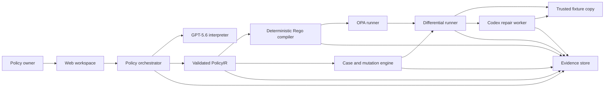

# PolicyTwin architecture

Status: partial offline implementation. Dashed responsibilities require approved external integration.

Implemented offline:

- strict refund input and `PolicyIR` validation;
- explicit ambiguity patches and state transitions;
- deterministic Rego source generation;
- policy-derived cases, conflicts, contrasts, and mutation execution;
- reference differential reports for canonical and evaluation-only fixtures;
- guarded repair-worker contracts and isolated trusted copies;
- change impact, traceability, and fail-closed evidence manifests.

Not yet authoritative:

- GPT-5.6 and Codex nodes require current official API verification and fresh live evidence;
- OPA source exists but no installed runtime has compiled or evaluated it;
- the web workspace, persistence, health endpoint, container, and deployment do not exist.

The application boundary accepts only the bundled `seeded-refund-demo` fixture for write execution. Policy text is untrusted semantic input; it never becomes executable code directly.
