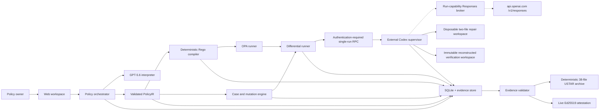

# PolicyTwin architecture

Status: partial offline implementation. Dashed responsibilities require approved external integration.

Implemented offline:

- strict refund input and `PolicyIR` validation;
- explicit ambiguity patches and state transitions;
- deterministic Rego source generation;
- policy-derived cases, conflicts, contrasts, and mutation execution;
- reference differential reports for canonical and evaluation-only fixtures;
- guarded repair-worker contracts, isolated trusted copies, a pinned server-side Codex SDK-compatible adapter contract, and a Node TLS 1.3 mutual-authentication client/supervisor with fixed CA/name/certificate pins/ALPN, one bounded canonical request/response frame, a durable SQLite request-ID/nonce replay store, single-active-run cancellation, immutable image/baseline/corpus bindings, baseline/final tree-manifest delta validation, and trusted Ed25519 supervisor receipts;
- change impact, traceability, aggregate evidence hashes, semantic cross-checks, a closed byte-deterministic 38-file USTAR download, and a trusted live-attestation boundary;
- SQLite-backed policy, version, lifecycle, golden-case, and decision persistence with restart recovery;
- framework-independent workspace orchestration for current-state reads, immutable text versions, and atomic ambiguity resolution;
- checksum-pinned OPA 1.18.2 compile/evaluation over all 41 accepted cases;
- a six-view Next.js workspace with real versioned decision/source writes, health/evidence/interpret/workspace routes, and local Chrome E2E coverage.
- a fail-closed standalone web Dockerfile contract that excludes the live Codex worker and requires an immutable Node image digest before dynamic build;
- separate static worker/verifier/egress Dockerfiles and deterministic lifecycle contracts that fix non-root users, read-only roots, dropped capabilities, resource ceilings, a read-only baseline plus exactly two writable file overlays, an internal worker network, a credential-free `network=none` verifier, explicit create/start/wait/logs/stop/remove operations, and external-only provider/TLS-key mounts;
- a prepared worker entrypoint that validates the canonical RPC request, empty fixed `CODEX_HOME`, proxy token, and CA mount but can emit only a non-live disabled receipt; command-backed Codex provider authentication reads a 256-bit per-run capability rather than a provider credential;
- a Responses-only reverse-broker implementation and local fake-upstream integration test. It fixes method/path/authority, request and response byte limits, bounded lease use, header/framing rules, no redirects or compression, public-IPv4 DNS selection, a pinned IP connection, and OpenAI SNI/certificate/Host identity. This remains static/offline evidence until the prepared container and real upstream path run.

Proof and Change Impact are bound to the recorded reference policy by a deterministic semantic fingerprint covering version, clauses, rules, ambiguity selections, defaults, normalization, and the input schema. Opaque per-session IDs and model provenance are excluded from that equality check. A mismatch is shown explicitly and blocks the reference 14-to-30 draft; it never re-labels the static evidence or its archive as proof for a different session policy. The archive route reads no directory listing: it loads exactly `REQUIRED_EVIDENCE_FILES`, validates the full package and any live attestation, rejects sensitive content, and emits fixed USTAR headers and ordering in memory.

Not yet authoritative:

- GPT-5.6 and Codex nodes still require fresh credentialed execution and signed live evidence. The mTLS transport and bounded supervisor are verified on real loopback sockets with ephemeral certificates, but their injected integration executor emits only an explicit signed `FAIL` test result. Worker/verifier/egress image definitions, a generic supervisor-owned lifecycle coordinator, and fixed launch plans exist but have no immutable image digest or dynamic run. The Docker driver is not connected, the proxy has not made real DNS/TLS/OpenAI traffic, no SDK turn exists, and the host live-backend factory still rejects;
- the 14-to-30 impact candidate is a persisted text-only `DRAFT`; it is not accepted PolicyIR and remains blocked by G02;
- mutation execution remains reference-based rather than OPA-backed;
- the web, worker, verifier, and egress Dockerfiles and daemon-free static checks exist, but their image digests, dynamic container health/isolation, live proxy path, live browser run, and deployment do not.

The offline persistence adapter uses Node.js 22's built-in experimental `node:sqlite` API behind `SQLitePolicyRepository`. Each anonymous browser session maps to a hashed internal project ID; only same-origin browser fetches may create a session, expired projects are removed after 24 hours, and a process stores at most 128 active anonymous projects. Public-origin and HTTPS configuration is validated before project creation, and every mutation rechecks server-side expiry before writing. Browser mutations accept only the public seeded policy ID, version path, and closed option/source body; an exact configured production origin, an HttpOnly SameSite session and CSRF cookie, a matching custom header, byte and ten-second body limits, and a single-process write gate protect the route. Production readiness remains unclaimed until authentication, shared quotas, the selected container runtime, backup behavior, distributed coordination, and deployment persistence volume are verified.

The application boundary accepts only the bundled `seeded-refund-demo` fixture for write execution. Policy text is untrusted semantic input; it never becomes executable code directly.
